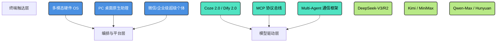

<div align="center">


# 📖 2026 AI Agent Landscape & Architecture

**中文版** | **[English](./README_EN.md)**

[](https://vitepress.dev/)
[](https://Electricitysheep.github.io/2026-ai-agent-book)
[](https://github.com/Electricitysheep/2026-ai-agent-book/stargazers)
[](https://github.com/Electricitysheep/2026-ai-agent-book/network/members)
[](http://makeapullrequest.com)
[](https://opensource.org/licenses/MIT)

> *为您节省 100+ 小时研读晦涩文档的时间。深度解析 2026 国内大模型与 Agent 架构生态。涵盖架构分析、代码示例、以及多模态技术栈的完整参考体系。*

</div>

> ⏳ **持续追踪更新预警 (2026 State of the Art)** <br>
> *本项目将伴随 2026 年大模型生态的爆炸式演进保持每周更新！请立刻点亮右上角的 ⭐️ **Star**，随时获取国内最前沿 Agent 架构的硬核剖析与最新动态，切勿走失！*

## 🔥 Awesome Agents 2026 (高价值工具与框架导航)
我们整理了一份详尽的 2026 必看 AI Agent 框架与工具集合。如果您想快速寻找合适的生态工具，请直接查看这份列表：
👉 **[点击这里查看 AWESOME_AGENTS.md](./AWESOME_AGENTS.md)**

---

## 🌟 项目亮点 (Why this repository?)
不同于常规的链接导航仓库，本项目对标大厂系统设计规范，提供了详尽的底层协议分析、代码案例、基准测试，以及各核心平台的架构横向对比。我们深入剖析了从云端沙盒、MCP 协议到系统级控制的演进历程。

## 📚 体系索引 (Table of Contents)

### 国内大模型与 Agent 生态双雄
* [第一部分：DeepSeek (深度求索) 的破局之路](./docs/vol1.md)
* [第二部分：字节跳动 (ByteDance) Trae 2.0 与 Coze 演进](./docs/vol2.md)
* [第三部分：阿里巴巴 (Alibaba) 通义灵码与 Qwen 生态](./docs/vol3.md)
* [第四部分：智谱 AI (Zhipu) GLM 与 AutoClaw](./docs/vol4.md)

### 开源硬件与底层协议框架
* [第五部分：硬件与开源架构生态 (Open-Source & Hardware)](./docs/vol5.md)

### 大厂全家桶与多模态原生
* [第六部分：腾讯 (Tencent) CodeBuddy 与万物智联](./docs/vol6.md)
* [第七部分：月之暗面 (Moonshot) Kimi 与超长上下文](./docs/vol7.md)
* [第八部分：百度 (Baidu) 文心一言与 Comate](./docs/vol8.md)
* [第九部分：MiniMax (稀宇科技) Hailuo 多模态平台](./docs/vol9.md)

### 国际视野与终极基准
* [第十部分：全球视野与 SWE-bench 基准测试](./docs/vol10.md)

---

## 🚀 网页版与在线白皮书

我们提供了一个完整编译的静态页面以获得最佳阅读体验：
👉 **[点击这里访问完整网站 (VitePress)](https://Electricitysheep.github.io/2026-ai-agent-book)**

同时，我们也在仓库根目录提供了一份合并好的完整单文件白皮书供离线阅读：[2026_AI_Agent_Landscape_Whitepaper.md](./2026_AI_Agent_Landscape_Whitepaper.md)。

## 🌐 2026 Agent 生态全景架构 (Ecosystem Architecture)



## 📖 核心章节概览 (Quick Start)

本项目基于 Vue 驱动的 **VitePress** 构建，提供极致的阅读体验。

```bash
# 1. 克隆仓库
git clone https://github.com/Electricitysheep/2026-ai-agent-book.git
cd 2026-ai-agent-book

# 2. 安装依赖
npm install

# 3. 启动本地热更新服务器
npm run docs:dev
```
启动后，访问 `http://localhost:5173` 即可阅读这本技术内参。

## 🤝 参与贡献 (Contributing)
我们非常欢迎开源社区的贡献者参与进来，补充最新的 AI Agent 技术内幕。请参阅 [CONTRIBUTING.md](./CONTRIBUTING.md) 了解详细规范。

## 📈 Star 增长趋势 (Star History)

[](https://star-history.com/#Electricitysheep/2026-ai-agent-book&Date)

## 📜 许可证 (License)
本项目采用 [MIT License](./LICENSE) 协议开源。
