<div align="center">


# 📖 2026 AI Agent Landscape & Architecture

**[中文版 (Chinese)](./README.md)** | **English**

[](https://Electricitysheep.github.io/2026-ai-agent-book)
[](https://Electricitysheep.github.io/2026-ai-agent-book)
[](http://makeapullrequest.com)
[](https://opensource.org/licenses/MIT)

> *An in-depth analysis of the 2026 Chinese LLM and Agent Architecture ecosystem. A comprehensive reference guide covering architectural paradigms, code implementations, and multimodal tech stacks.*

</div>

## 🌟 Why this repository?
Unlike typical "awesome lists" or link aggregators, this project provides a **deep dive into system design patterns, underlying protocol analysis (MCP), code benchmarks, and horizontal architectural comparisons** of the core Chinese AI Agent platforms. We analyze the evolution from cloud sandboxes to OS-level integrations.

If you want to understand how DeepSeek, ByteDance, Alibaba, and Tencent are building the future of Agentic OS in 2026, this is your ultimate handbook.

---

## 🔥 Awesome Agents 2026
Looking for a quick list of the best frameworks, tools, and platforms? Check out our curated list:
👉 **[AWESOME_AGENTS.md](./AWESOME_AGENTS.md)**

---

## 📚 Table of Contents

### Part 1: The Titans of Chinese LLM & Agent Ecosystems
* [Vol 1: DeepSeek's Breakthrough](./docs/vol1.md)
* [Vol 2: ByteDance Trae 2.0 & Coze Evolution](./docs/vol2.md)
* [Vol 3: Alibaba Tongyi Lingma & Qwen Ecosystem](./docs/vol3.md)
* [Vol 4: Zhipu AI GLM & AutoClaw](./docs/vol4.md)

### Part 2: Open-Source Hardware & Underlying Protocols
* [Vol 5: Open-Source & Hardware Architecture](./docs/vol5.md)

### Part 3: Big Tech Suites & Multimodal Natives
* [Vol 6: Tencent CodeBuddy & AIoT](./docs/vol6.md)
* [Vol 7: Moonshot Kimi & Ultra-Long Context](./docs/vol7.md)
* [Vol 8: Baidu ERNIE & Comate](./docs/vol8.md)
* [Vol 9: MiniMax Hailuo Multimodal Platform](./docs/vol9.md)

### Part 4: Global Perspective & Ultimate Benchmarks
* [Vol 10: Global View & SWE-bench 2026 Benchmarks](./docs/vol10.md)

---

## 🚀 Interactive Web Version & Whitepaper

We provide a fully compiled static documentation site for the best reading experience:
👉 **[Read the Book Online (VitePress)](https://Electricitysheep.github.io/2026-ai-agent-book)**

Alternatively, you can read the compiled single-file offline whitepaper in the repository root: [2026_AI_Agent_Landscape_Whitepaper.md](./2026_AI_Agent_Landscape_Whitepaper.md).

## 🌐 2026 Agent Ecosystem Architecture

```mermaid
graph TD
    subaxis[Terminal Access Layer]
    subaxis_1(Multimodal Hardware OS)
    subaxis_2(PC Desktop Native Assistant)
    subaxis_3(WeChat/Enterprise Super Individual)
    
    layer2[Orchestration & Platform Layer]
    layer2_1(Coze 2.0 / Dify 2.0)
    layer2_2(MCP Protocol Bus)
    layer2_3(Multi-Agent Communication Framework)
    
    layer3[Model Driven Layer]
    layer3_1(DeepSeek-V3/R2)
    layer3_2(Kimi / MiniMax)
    layer3_3(Qwen-Max / Hunyuan)
    
    subaxis_1 --> layer2
    subaxis_2 --> layer2
    subaxis_3 --> layer2
    
    layer2_1 --> layer3
    layer2_2 --> layer3
    layer2_3 --> layer3
    
    classDef top fill:#4a90e2,stroke:#333,stroke-width:2px,color:#fff;
    classDef mid fill:#50e3c2,stroke:#333,stroke-width:2px,color:#000;
    classDef bot fill:#b8e986,stroke:#333,stroke-width:2px,color:#000;
    
    class subaxis_1,subaxis_2,subaxis_3 top;
    class layer2_1,layer2_2,layer2_3 mid;
    class layer3_1,layer3_2,layer3_3 bot;
```



## 📖 Quick Start

This project is built using Vue-driven **VitePress**.

```bash
# 1. Clone the repository
git clone https://github.com/Electricitysheep/2026-ai-agent-book.git
cd 2026-ai-agent-book

# 2. Install dependencies
npm install

# 3. Start local development server
npm run docs:dev
```
Open `http://localhost:5173` in your browser.

## 🤝 Contributing
We highly encourage contributions from the open-source community to keep this landscape updated. Please refer to [CONTRIBUTING.md](./CONTRIBUTING.md) for detailed guidelines.

## 📜 License
This project is licensed under the [MIT License](./LICENSE).
